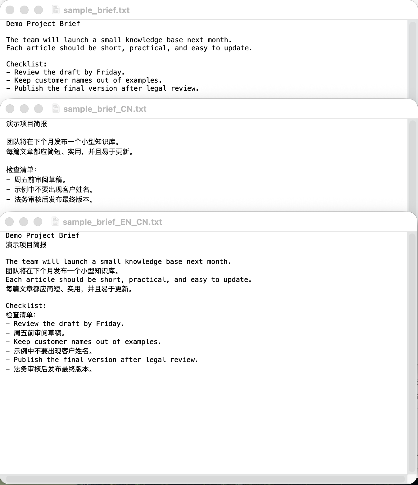
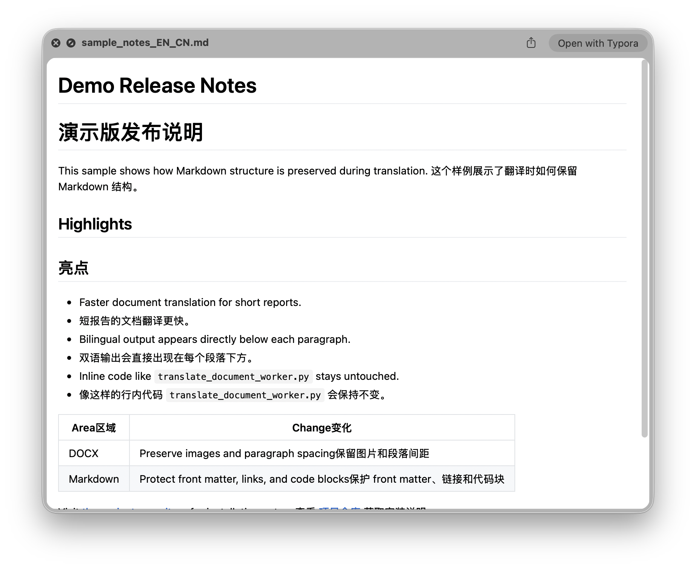
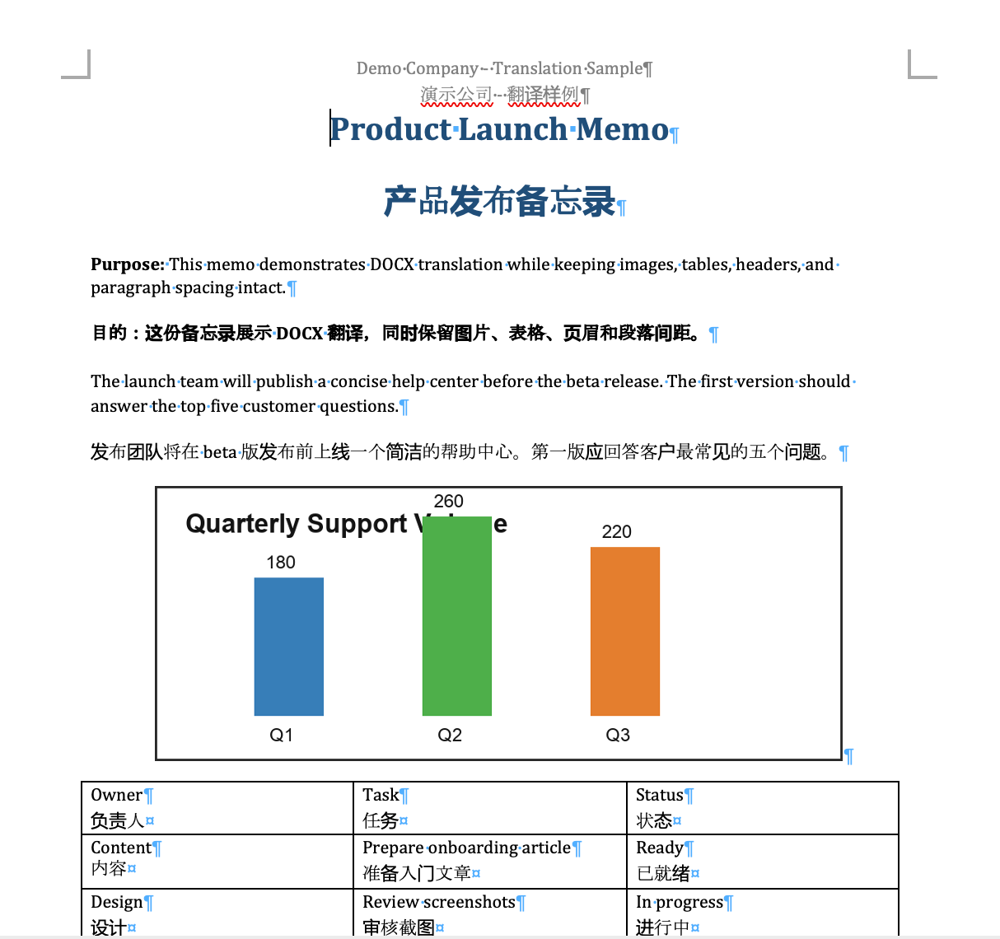
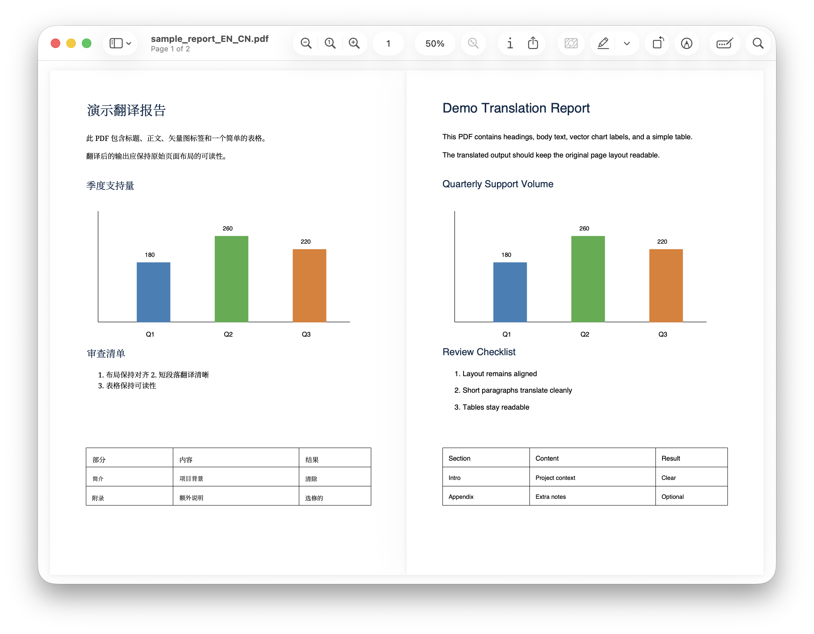
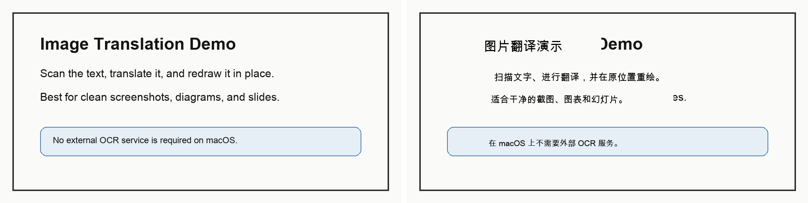

# Translate Document Quick Action

Translate documents, PDFs, and images directly from Finder on macOS. The project also includes audio/video transcription, image resizing and conversion, and searchable-PDF OCR in the same native utility app.

Select one or more files in Finder, open **Quick Actions**, choose a tool, review the options, and save the results beside the originals. Existing files are never overwritten.

## What It Includes

| Finder Quick Action | Input | Main capabilities | Output |
| --- | --- | --- | --- |
| **Translate PDF...** | PDF | Google or Bing translation through `pdf2zh-next`; monolingual, bilingual, or both | Translated PDF files |
| **Translate Document...** | TXT, Markdown, DOCX | Google, Bing, or local Ollama; structure-aware translation | Translated or bilingual documents |
| **Translate Image...** | PNG, JPEG, WebP, BMP, TIFF | Apple Vision OCR or `manga-image-translator`; multiple text backends | Translated image or side-by-side comparison |
| **Transcribe Audio...** | Common audio and video formats | MacWhisper transcription with optional translation | Transcript and translated TXT files |
| **Resize Image** | Common image formats, including HEIC | Resize, compress, strip metadata, and convert formats | New image file |
| **OCR PDF...** | PDF | Force OCR with OCRmyPDF and Tesseract | Searchable `_OCR.pdf` |
| **OCR Image...** | PNG, JPEG, TIFF, BMP | Convert an image into a searchable PDF | Searchable `_OCR.pdf` |

The current version uses a shared native Swift/AppKit application instead of opening a separate Tk window for every action. On macOS 26 it adopts system glass controls; older supported macOS versions use native AppKit fallbacks.

## Quick Start

### 1. Clone the repository

```bash
git clone https://github.com/Jingyuan-Zheng/translate-document-quick-action.git
cd translate-document-quick-action
```

### 2. Install the shared Python packages

The Finder app automatically checks common Homebrew and system Python locations. Install the packages into the Python interpreter that will run the workers:

```bash
python3 -m pip install -r requirements.txt
```

### 3. Build and install

```bash
python3 build_service_tools.py --install
```

This compiles the native app, bundles the worker scripts, and installs the seven Quick Actions under:

```text
~/Library/Services/
```

The shared app and workers are installed under:

```text
~/Library/Services/Service Tools/
```

### 4. Run a Quick Action

In Finder, select one or more supported files, right-click, and choose the required item under **Quick Actions**. If a newly installed action is not visible immediately, relaunch Finder or enable it in **System Settings → General → Login Items & Extensions → Finder**.

## Features in Detail

### Translate PDF

- Translates PDFs with `pdf2zh-next` and BabelDOC.
- Supports Google and Bing translation engines.
- Produces a translated-only PDF, a bilingual PDF, or both.
- Detects a source-language code for output naming when possible.
- Saves every result beside its source PDF without overwriting an existing file.

Example output names:

```text
paper_CN.pdf
paper_EN_CN.pdf
paper_CN.2.pdf
```

### Translate Document

- Accepts `.txt`, `.md`, `.markdown`, and `.docx` files.
- Supports Google, Bing, and local Ollama translation.
- Offers **Bilingual**, **Monolingual**, and **Both** output modes.
- Provides Chinese and English as quick targets, plus Japanese, Korean, German, French, Spanish, Italian, Portuguese, and Russian in the native interface.
- The worker CLI additionally supports Traditional Chinese, Ukrainian, Polish, Dutch, Swedish, Norwegian, Danish, Finnish, Turkish, Arabic, Hebrew, and Greek.
- Keeps TXT content line-oriented.
- Protects common Markdown structure such as code blocks, links, emphasis, headings, lists, and tables.
- Updates DOCX XML in place so the original package structure and media relationships remain intact.
- Handles normal document text as well as headers, footers, footnotes, endnotes, and comments.

Very complex Word content—including SmartArt, embedded objects, equations, and unusual text boxes—may require manual checking after translation.

### Translate Image

Two image pipelines are available:

**Simple macOS OCR**

- Uses Apple Vision for local text detection.
- Supports automatic source-language detection or explicit English, Japanese, and Chinese input.
- Translates detected text with Google, Bing, or Ollama.
- Covers source text using sampled background colours and draws translated text into the detected regions.
- Best suited to screenshots, slides, diagrams, and relatively clean layouts.

**Manga Translator**

- Calls a separately installed `manga-image-translator` environment.
- Supports Offline, Custom OpenAI, ChatGPT, and DeepL backends from the native interface.
- Can request GPU acceleration when available.
- Better suited to complex backgrounds, inpainting, manga, and more advanced text placement.

Monolingual mode creates the translated image. Bilingual mode produces a side-by-side image with the original on the left and the translated version on the right.

### Transcribe Audio or Video

- Uses the MacWhisper `mw` command-line tool.
- Accepts AAC, AIFF, FLAC, M4A, M4V, MOV, MP3, MP4, and WAV.
- Supports **Transcribe only**, **Transcribe + translate**, and **Translate output only** operations. The last option still transcribes internally but saves only translated output instead of a separate `_TRANSCRIPT.txt` file.
- Lets the user select a MacWhisper model or use the configured default.
- Can stream transcript progress into the app log.
- Translates transcripts with Google, Bing, or Ollama.
- Produces monolingual translation, bilingual translation, or both.

Example outputs:

```text
interview_TRANSCRIPT.txt
interview_CN.txt
interview_EN_CN.txt
```

### Resize, Compress, and Convert Images

- Uses ImageMagick rather than Pillow for final encoding.
- Resizes from 1% to 200% or to custom width and height.
- Preserves aspect ratio by default and keeps width/height fields synchronized.
- Compresses and strips metadata without changing dimensions.
- Supports Original Format, JPEG, PNG, WebP, AVIF, HEIC, and TIFF output.
- Uses separate default quality values for resizing (`92`) and compression (`85`).
- Applies quality controls only to lossy formats.
- Uses lossless ImageMagick compression settings for PNG.
- Flattens transparent images onto a white background when converting to JPEG.
- Automatically rotates images according to their orientation metadata before stripping metadata.

Output names describe the operation and avoid collisions, for example:

```text
photo_1280x853.jpg
photo_optimized_webp.webp
photo_optimized_webp_2.webp
```

### OCR PDF and Images

- Uses OCRmyPDF and Tesseract with force-OCR mode.
- Accepts PDFs and common image formats.
- Estimates a suitable DPI when an image does not provide usable DPI metadata.
- Converts transparent images to a temporary white-background RGB image before OCR.
- Saves results as `<original-name>_OCR.pdf` beside the source.
- Keeps the main app hidden during normal OCR processing.
- Shows a compact completion alert on success and opens the full log window only on failure.

## Output and Safety Behaviour

- Source files are never modified or overwritten.
- All generated files are written beside the source file.
- Existing output names gain `.2`, `.3`, and later suffixes, or `_2`, `_3`, and later suffixes depending on the tool.
- Multiple selected files are processed in one run and summarized in the shared log.
- The app validates extensions before launching a worker.
- Missing dependencies and worker failures remain visible in the log instead of being silently ignored.

## Dependencies

### Base requirements

- macOS 13 or later.
- Xcode Command Line Tools, including `swiftc`.
- Python 3.10 or later.
- Packages listed in `requirements.txt`: Requests, lxml, PyMuPDF, and Pillow.

### Tool-specific requirements

Install only the components needed for the tools you plan to use:

```bash
# PDF translation
uv tool install --python python3.13 "pdf2zh-next==2.6.4" --with "BabelDOC==0.5.16"

# Resize, compress, and convert images
brew install imagemagick

# OCR PDFs and images
brew install ocrmypdf tesseract

# Apple Vision image translation
python3 -m pip install \
  pyobjc-framework-Vision \
  pyobjc-framework-Quartz \
  pyobjc-framework-AppKit
```

For audio transcription, install MacWhisper 13.20 or later and enable its command-line tool under **MacWhisper → Settings → Advanced → Command-Line Tool**.

For advanced image translation, install [`manga-image-translator`](https://github.com/zyddnys/manga-image-translator) separately and set `MANGA_TRANSLATOR_PYTHON` if its Python interpreter cannot be discovered automatically.

For local document or transcript translation, run Ollama and configure these optional variables when needed:

```bash
export OLLAMA_HOST=http://127.0.0.1:11434
export OLLAMA_MODEL=qwen3.5:9b
```

The workers also recognize variables such as `PDF2ZH_NEXT_BIN`, `MACWHISPER_MODEL`, and `TRANSLATION_TOOLS_PYTHON`. Environment variables set only in an interactive shell may not automatically be inherited by Finder; for Finder Quick Actions, installing dependencies into a standard Homebrew Python location is the simplest setup.

## Build, Install, and Inspect the Workflows

Build without installing:

```bash
python3 build_service_tools.py
```

Generated artifacts are written to `dist/`.

Build and install for the current user:

```bash
python3 build_service_tools.py --install
```

The repository also contains reviewable XML copies of all seven Finder workflow bundles under `workflows/`. Refresh them from the same source definitions used by the builder:

```bash
python3 build_service_tools.py --export-workflows
```

Every committed workflow starts the app through a portable `$HOME/Library/Services/...` path. The repository does not contain a contributor's username, home directory, volume name, or device-specific path.

## Command-Line Usage

The Python workers can be used without Finder or the native app:

```bash
# TXT, Markdown, and DOCX
python3 scripts/translate_document_worker.py \
  --engine google --lang-out zh --mode both notes.md report.docx

# PDF
python3 scripts/translation_pdf_worker.py \
  --engine google --lang-out zh --mode both paper.pdf

# Image with Apple Vision OCR
python3 scripts/translate_image_worker.py \
  --image-engine simple-macos --text-engine google \
  --lang-in auto --lang-out zh --mode both screenshot.png

# Audio/video transcription and translation
python3 scripts/translate_audio_worker.py \
  --operation both --engine google --lang-out zh \
  --mode dual interview.m4a

# Resize to 50%
python3 scripts/resize_image_worker.py \
  --operation resize --mode percentage --percentage 50 \
  --format original --preserve-aspect photo.jpg

# OCR
python3 scripts/ocr_worker.py scan.png document.pdf
```

Run any worker with `--help` for its complete option list.

## Translation and Privacy Notes

- Google and Bing modes use public web endpoints, not paid official APIs. These endpoints may be rate-limited or changed upstream.
- Files or extracted text processed through an online translation service leave the local machine.
- Use Ollama for local text translation when document sensitivity requires local processing.
- Apple Vision OCR runs locally; the later translation step follows the selected Google, Bing, or Ollama text backend.
- `manga-image-translator`, MacWhisper, `pdf2zh-next`, and their configured backends have their own privacy and licensing terms.
- No API keys, personal directories, machine names, generated user documents, or third-party model files are included in this repository.

## Legacy Tk Version

The original Python/Tk implementation is preserved under [`legacy/tk`](legacy/tk/README.md). It includes the earlier standalone GUI scripts and installer and has not been deleted.

Do not install the legacy and current Quick Actions at the same time because several Finder menu names overlap. New development targets the native Swift application.

## Output Examples

### TXT translation



### Markdown bilingual translation



### DOCX bilingual translation



### PDF bilingual translation



### Image bilingual translation



## Repository Layout

```text
app/Sources/TranslationTools.swift   Native macOS interface
scripts/                             Current Python workers
workflows/                           Reviewable Finder Quick Action bundles
build_service_tools.py               App, worker, and workflow builder
tests/                               Privacy and portability checks
legacy/tk/                           Archived pre-Swift implementation
docs/images/                         Output examples
```

## Development Checks

Before publishing a change:

```bash
python3 -m compileall -q build_service_tools.py scripts legacy/tk
python3 -m unittest discover -s tests
python3 build_service_tools.py --export-workflows
git diff --check
```

## License

MIT. This repository does not vendor `pdf2zh-next`, BabelDOC, OCRmyPDF, Tesseract, ImageMagick, MacWhisper, or `manga-image-translator`.
