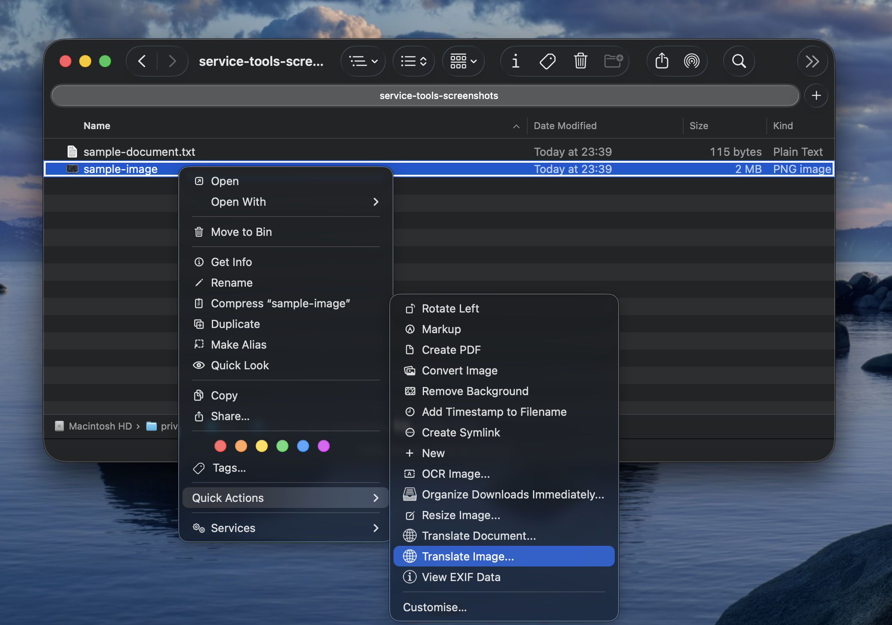
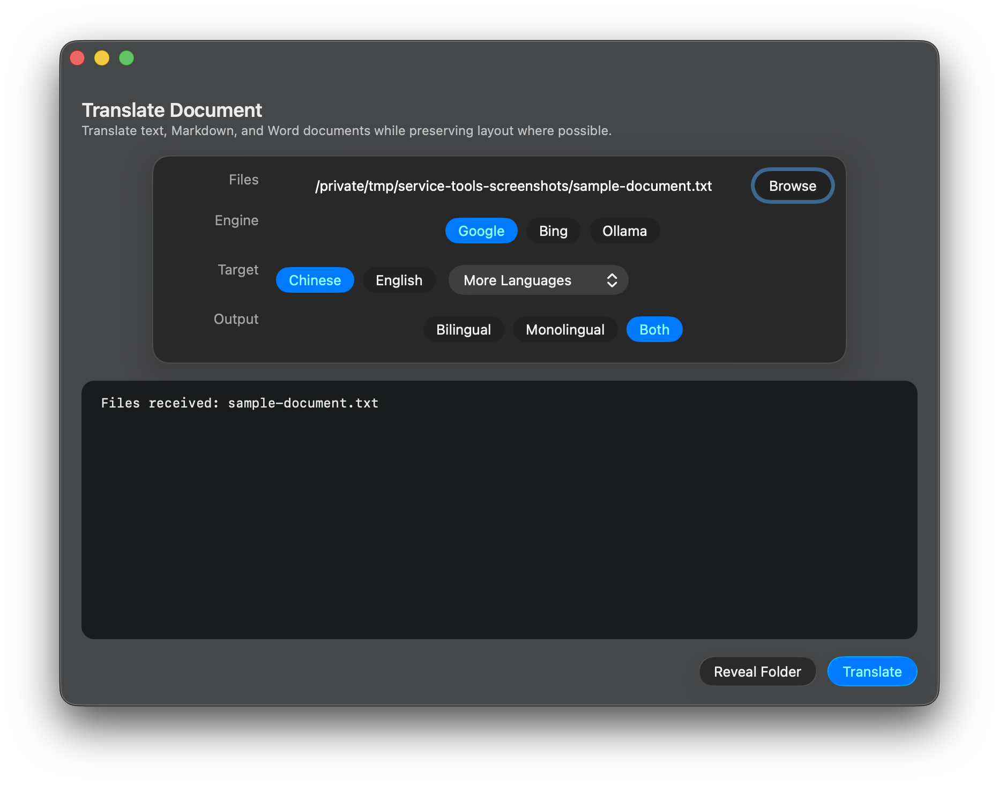
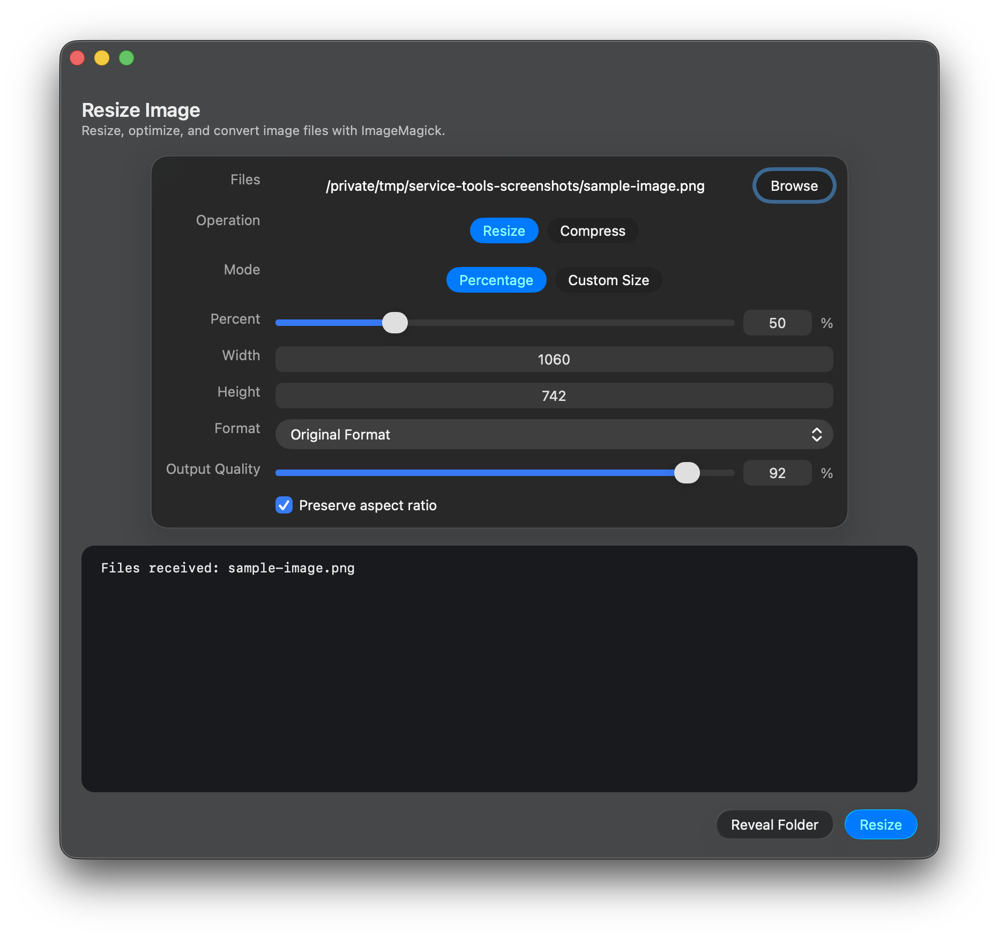

# Translate Document Quick Action

[English](README.md) | [简体中文](README.zh-CN.md)

一套原生 macOS 工具，可直接从 Finder 翻译文档、PDF 和图片。项目还在同一个应用中提供音视频转录、图片缩放与格式转换，以及生成可搜索 PDF 的 OCR 功能。

在 Finder 中选择一个或多个文件，打开“快速操作”，选择所需工具并确认选项，结果会保存在原文件旁边。工具不会覆盖已有文件。



## 原生界面

统一的 Service Tools App 只显示当前操作相关的选项。

| 翻译文档 | 调整图片尺寸 |
| --- | --- |
|  |  |

## 包含的工具

| Finder 快速操作 | 输入 | 主要功能 | 输出 |
| --- | --- | --- | --- |
| **Translate PDF...** | PDF | 通过 `pdf2zh-next` 使用 Google 或 Bing；支持单语、双语或同时输出 | 翻译后的 PDF |
| **Translate Document...** | TXT、Markdown、DOCX | Google、Bing 或本地 Ollama；尽量保留文档结构 | 翻译或双语文档 |
| **Translate Image...** | PNG、JPEG、WebP、BMP、TIFF | Apple Vision OCR 或 `manga-image-translator`；支持多种文本翻译后端 | 翻译图片或左右对照图 |
| **Transcribe Audio...** | 常见音频和视频格式 | MacWhisper 转录，并可继续翻译 | 转录及翻译后的 TXT |
| **Resize Image** | 常见图片格式，包括 HEIC | 缩放、压缩、清除元数据和格式转换 | 新图片文件 |
| **OCR PDF...** | PDF | 使用 OCRmyPDF 和 Tesseract 强制 OCR | 可搜索的 `_OCR.pdf` |
| **OCR Image...** | PNG、JPEG、TIFF、BMP | 将图片转换为可搜索 PDF | 可搜索的 `_OCR.pdf` |

当前版本使用统一的 Swift/AppKit 原生应用，不再为每个操作分别打开 Tk 窗口。在 macOS 26 上会使用系统玻璃控件，较早的受支持 macOS 版本使用原生 AppKit 回退界面。

## 安装

### 下载 v2.0.0 Release

从 [最新 GitHub Release](https://github.com/Jingyuan-Zheng/translate-document-quick-action/releases/latest) 下载 `Translate-Document-Quick-Action-v2.0.0.zip` 和 `SHA256SUMS.txt`。如有需要，先核对 SHA-256；解压后在该目录运行：

```bash
python3 install.py
```

发布包包含原生 App、当前 Python Workers、七个 Finder workflow，以及独立安装脚本。翻译、OCR、转录和图片处理所需的第三方依赖不会打包进去。

下载版 App 使用 ad-hoc 签名，但未经 Apple 公证。如果下载后被 macOS 阻止，请检查源码并选择本地构建，或者移除已安装 App 的隔离属性：

```bash
xattr -dr com.apple.quarantine \
  "$HOME/Library/Services/Service Tools/Service Tools.app"
```

### 从源码构建

#### 1. 克隆仓库

```bash
git clone https://github.com/Jingyuan-Zheng/translate-document-quick-action.git
cd translate-document-quick-action
```

#### 2. 安装共用 Python 包

Finder App 会检查常见的 Homebrew 和系统 Python 路径。请把依赖安装到实际运行 Workers 的 Python 中：

```bash
python3 -m pip install -r requirements.txt
```

#### 3. 构建并安装

```bash
python3 build_service_tools.py --install
```

该命令会编译原生 App、打包 Workers，并把七个快速操作安装到：

```text
~/Library/Services/
```

App 和 Workers 位于：

```text
~/Library/Services/Service Tools/
```

#### 4. 运行快速操作

在 Finder 中选择受支持的文件，右键并在“快速操作”中选择所需工具。如果新安装的操作没有立即出现，可以重新启动 Finder，或前往“系统设置 → 通用 → 登录项与扩展 → Finder”启用。

## 功能详情

### 翻译 PDF

- 使用 `pdf2zh-next` 和 BabelDOC 翻译 PDF。
- 支持 Google 和 Bing 翻译引擎。
- 可以生成纯译文 PDF、双语 PDF，或两者同时生成。
- 尽可能检测源语言代码，用于输出文件命名。
- 所有结果保存在原 PDF 旁边，不覆盖已有文件。

示例：

```text
paper_CN.pdf
paper_EN_CN.pdf
paper_CN.2.pdf
```

### 翻译文档

- 支持 `.txt`、`.md`、`.markdown` 和 `.docx`。
- 支持 Google、Bing 和本地 Ollama。
- 提供“双语”“单语”和“两者都生成”三种输出模式。
- 原生界面提供中文、英文快捷目标语言，以及日语、韩语、德语、法语、西班牙语、意大利语、葡萄牙语和俄语。
- Worker CLI 还支持繁体中文、乌克兰语、波兰语、荷兰语、瑞典语、挪威语、丹麦语、芬兰语、土耳其语、阿拉伯语、希伯来语和希腊语。
- TXT 按行处理并尽量保留布局。
- 保护代码块、链接、强调、标题、列表和表格等常见 Markdown 结构。
- 在 DOCX 包内部修改 Word XML，保留原包结构和媒体关系。
- 处理正文、页眉、页脚、脚注、尾注和批注中的普通文本。

SmartArt、嵌入对象、公式和特殊文本框等复杂 Word 内容，翻译后可能仍需人工检查。

### 翻译图片

提供两套图片处理管线：

**Simple macOS OCR**

- 使用 Apple Vision 在本地识别文本。
- 支持自动检测源语言，或指定英文、日文、中文。
- 使用 Google、Bing 或 Ollama 翻译识别出的文字。
- 用采样背景色覆盖原文字，并在检测区域中绘制译文。
- 更适合截图、幻灯片、图表和背景较干净的图片。

**Manga Translator**

- 调用另行安装的 `manga-image-translator` 环境。
- 原生界面提供 Offline、Custom OpenAI、ChatGPT 和 DeepL 后端。
- 可以在可用时请求 GPU 加速。
- 更适合复杂背景、修复、漫画和高级文本排版。

单语模式生成翻译图片；双语模式生成左右对照图，左侧为原图，右侧为翻译结果。

### 转录音频或视频

- 使用 MacWhisper 的 `mw` 命令行工具。
- 支持 AAC、AIFF、FLAC、M4A、M4V、MOV、MP3、MP4 和 WAV。
- 支持“仅转录”“转录并翻译”和“只保存翻译输出”。最后一种仍会在内部执行转录，但不会单独保存 `_TRANSCRIPT.txt`。
- 可选择 MacWhisper 模型或使用默认模型。
- 可以把实时转录进度输出到 App 日志。
- 使用 Google、Bing 或 Ollama 翻译转录文本。
- 可生成单语译文、双语译文或两者同时生成。

示例：

```text
interview_TRANSCRIPT.txt
interview_CN.txt
interview_EN_CN.txt
```

### 图片缩放、压缩与格式转换

- 最终编码使用 ImageMagick，而不是 Pillow。
- 支持 1% 至 200% 的百分比缩放，或自定义宽度和高度。
- 默认保持宽高比，宽高输入会联动更新。
- 可在尺寸不变的情况下重新压缩并清除元数据。
- 支持原格式、JPEG、PNG、WebP、AVIF、HEIC 和 TIFF。
- 缩放默认质量为 `92`，压缩默认质量为 `85`。
- 质量参数只应用于有损格式。
- PNG 使用无损 ImageMagick 压缩设置。
- 转换为 JPEG 时，会把透明区域铺在白色背景上。
- 清除元数据前会根据方向信息自动旋转图片。

输出文件名会描述操作并避免冲突：

```text
photo_1280x853.jpg
photo_optimized_webp.webp
photo_optimized_webp_2.webp
```

### OCR PDF 和图片

- 使用 OCRmyPDF 和 Tesseract 的强制 OCR 模式。
- 支持 PDF 和常见图片格式。
- 图片没有有效 DPI 信息时会估算合适的 DPI。
- 透明图片会先转换成临时白底 RGB 图片。
- 结果以 `<原文件名>_OCR.pdf` 保存到原文件旁边。
- 正常 OCR 期间不显示主窗口。
- 成功时显示紧凑完成提示；失败时才打开完整日志窗口。

## 输出和安全行为

- 不修改或覆盖源文件。
- 所有新文件保存在源文件旁边。
- 文件名冲突时，根据不同工具自动增加 `.2`、`.3` 或 `_2`、`_3` 等后缀。
- 一次可处理多个选中文件，并在统一日志中总结结果。
- 启动 Worker 前会检查文件扩展名。
- 缺少依赖或 Worker 失败时会在日志中明确显示，不会静默忽略。

## 依赖

### 基础要求

- macOS 13 或更高版本。
- Xcode Command Line Tools，包括 `swiftc`。
- Python 3.10 或更高版本。
- `requirements.txt` 中的 Requests、lxml、PyMuPDF 和 Pillow。

### 按功能安装的依赖

只需安装实际使用功能所需的部分：

```bash
# PDF 翻译
uv tool install --python python3.13 "pdf2zh-next==2.6.4" --with "BabelDOC==0.5.16"

# 图片缩放、压缩和转换
brew install imagemagick

# PDF 与图片 OCR
brew install ocrmypdf tesseract

# Apple Vision 图片翻译
python3 -m pip install \
  pyobjc-framework-Vision \
  pyobjc-framework-Quartz \
  pyobjc-framework-AppKit
```

音视频转录需要 MacWhisper 13.20 或更高版本，并在“MacWhisper → Settings → Advanced → Command-Line Tool”中启用命令行工具。

高级图片翻译需要单独安装 [`manga-image-translator`](https://github.com/zyddnys/manga-image-translator)。如果无法自动找到其 Python，请设置 `MANGA_TRANSLATOR_PYTHON`。

本地文档或转录翻译需要运行 Ollama，可按需配置：

```bash
export OLLAMA_HOST=http://127.0.0.1:11434
export OLLAMA_MODEL=qwen3.5:9b
```

Workers 还识别 `PDF2ZH_NEXT_BIN`、`MACWHISPER_MODEL` 和 `TRANSLATION_TOOLS_PYTHON` 等变量。只在交互式 Shell 中设置的环境变量不一定会被 Finder 继承；Finder 快速操作最简单的配置方式，是把依赖安装在标准 Homebrew Python 路径中。

## 构建、安装和检查 Workflows

只构建、不安装：

```bash
python3 build_service_tools.py
```

产物输出到 `dist/`。

构建并安装到当前用户：

```bash
python3 build_service_tools.py --install
```

仓库在 `workflows/` 中保存了七个可审阅的 XML workflow。可以使用同一套构建定义刷新：

```bash
python3 build_service_tools.py --export-workflows
```

所有公开 workflow 都通过 `$HOME/Library/Services/...` 启动 App，不包含贡献者用户名、私人主目录、磁盘卷名或设备专用路径。

## 命令行用法

无需 Finder 或原生 App，也可以直接运行 Python Workers：

```bash
# TXT、Markdown、DOCX
python3 scripts/translate_document_worker.py \
  --engine google --lang-out zh --mode both notes.md report.docx

# PDF
python3 scripts/translation_pdf_worker.py \
  --engine google --lang-out zh --mode both paper.pdf

# Apple Vision OCR 图片翻译
python3 scripts/translate_image_worker.py \
  --image-engine simple-macos --text-engine google \
  --lang-in auto --lang-out zh --mode both screenshot.png

# 音视频转录并翻译
python3 scripts/translate_audio_worker.py \
  --operation both --engine google --lang-out zh \
  --mode dual interview.m4a

# 缩放到 50%
python3 scripts/resize_image_worker.py \
  --operation resize --mode percentage --percentage 50 \
  --format original --preserve-aspect photo.jpg

# OCR
python3 scripts/ocr_worker.py scan.png document.pdf
```

对任一 Worker 使用 `--help` 可查看完整参数列表。

## 翻译与隐私说明

- Google 和 Bing 模式使用公开网页端点，而不是付费官方 API，可能会受到限流或上游变化影响。
- 通过在线翻译服务处理的文件或提取文本会离开本机。
- 敏感文档需要本地处理时，请使用 Ollama。
- Apple Vision OCR 在本地运行；后续翻译是否联网取决于选择的 Google、Bing 或 Ollama 后端。
- `manga-image-translator`、MacWhisper、`pdf2zh-next` 及其后端有各自的隐私与许可条款。
- 仓库不包含 API Key、私人目录、设备名称、用户生成文档或第三方模型文件。

## 旧 Tk 版本

原始 Python/Tk 实现完整保存在 [`legacy/tk`](legacy/tk/README.md)，包括早期独立 GUI 脚本和安装器，没有被删除。

旧版与当前版使用了部分相同的 Finder 菜单名称，请勿同时安装。新功能开发以原生 Swift App 为准。

## 输出示例

### TXT 翻译


### Markdown 双语翻译


### DOCX 双语翻译


### PDF 双语翻译


### 图片双语翻译


## 仓库结构

```text
app/Sources/TranslationTools.swift   原生 macOS 界面
scripts/                             当前 Python Workers
workflows/                           可审阅的 Finder 快速操作
build_service_tools.py               App、Workers 与 workflow 构建器
install_release.py                   发布包独立安装器
tests/                               隐私与可移植性检查
legacy/tk/                           存档的 Swift 之前版本
docs/images/                         界面和输出示例
```

## 开发检查

发布修改前运行：

```bash
python3 -m compileall -q build_service_tools.py scripts legacy/tk
python3 -m unittest discover -s tests
python3 build_service_tools.py --export-workflows
python3 build_service_tools.py --package-release
git diff --check
```

## 许可证

MIT。本仓库不打包 `pdf2zh-next`、BabelDOC、OCRmyPDF、Tesseract、ImageMagick、MacWhisper 或 `manga-image-translator`。
